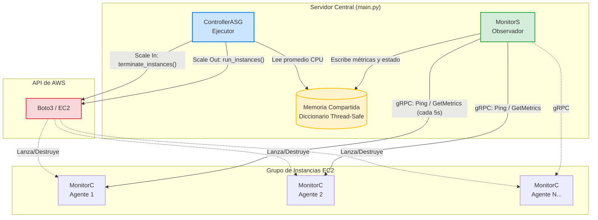

# Documento de Sustentación: Proyecto de Auto Escalamiento (ASG)

Este documento explica en detalle la arquitectura, tecnologías y el funcionamiento del código del proyecto para prepararte para la sustentación ante el profesor.

---

## 1. Arquitectura General y Tecnologías

El proyecto implementa un sistema distribuido clásico de **control y monitoreo**. En lugar de usar el servicio automático de Auto Scaling de AWS, construimos nuestro propio "cerebro" que toma las decisiones de cuándo crear o destruir servidores.

### Diagrama de Arquitectura

### Tecnologías Clave Utilizadas:
1. **Python 3:** Elegido por su facilidad para manejar concurrencia (hilos) y su excelente soporte oficial para las librerías necesarias.
2. **gRPC (Google Remote Procedure Call) y Protocol Buffers:** En lugar de usar HTTP/REST (que es más lento y pesado), usamos gRPC. gRPC permite que un programa llame a una función de otro programa en otra máquina como si fuera una función local. Protocol Buffers (`.proto`) nos permite definir mensajes fuertemente tipados (sabemos exactamente qué datos se envían y reciben).
3. **Boto3 (AWS SDK for Python):** Es la librería oficial de Amazon. Nos permite interactuar con la API de AWS para crear (`run_instances`) y destruir (`terminate_instances`) máquinas EC2 desde el código.
4. **Threading (Concurrencia):** Usamos hilos (`threads`) y bloqueos (`locks` o *mutexes*) para manejar múltiples tareas a la vez de forma segura (ej. monitorear instancias mientras en paralelo se evalúan las políticas de escalamiento).

---

## 2. Estructura del Código

El proyecto está dividido en 3 grandes bloques:

### A. El Contrato de Comunicación (`proto/monitor.proto`)
Este es el archivo más importante para la arquitectura, porque es el "contrato" entre el servidor y los agentes.
*   **Servicio `AgentService`:** Define qué preguntas se le pueden hacer a un Agente.
*   `Ping`: Es el **Heartbeat** (latido de corazón). El servidor pregunta "¿estás vivo?". Si el agente responde, sabemos que la máquina está bien. Si falla 3 veces, la damos por muerta (DEAD).
*   `GetMetrics`: El servidor pide la carga actual de la máquina (CPU y Memoria).

### B. El Agente (`agent/monitor_c.py`)
Este código debe correr **adentro de cada máquina EC2** que queremos escalar.
*   **Servidor gRPC:** Se queda escuchando en el puerto 50051 esperando que el MonitorS lo llame. Cuando recibe un `Ping`, responde de inmediato. Cuando recibe un `GetMetrics`, devuelve la carga actual.
*   **Simulador de Carga (`LoadSimulator`):** Como no tenemos usuarios reales, creamos un hilo que corre en segundo plano calculando una onda sinusoidal matemática (`math.sin`). Esto hace que la "CPU" suba y baje suavemente a lo largo del tiempo (entre 5% y 95%), simulando un comportamiento real.

### C. El Servidor Central (`server/`)
Este es el "Cerebro" del Auto Escalamiento. Corre en una máquina aparte y tiene tres archivos:

1.  **`monitor_s.py` (El Observador):**
    *   Mantiene una lista en memoria (un diccionario) de todas las instancias conocidas.
    *   Corre un hilo infinito que cada 5 segundos recorre la lista y hace un llamado gRPC (`Ping` y `GetMetrics`) a cada agente.
    *   Usa un **Lock** (`threading.Lock()`). Esto es vital para la sustentación: como varios hilos van a leer y escribir el diccionario de instancias al mismo tiempo, el Lock evita que los datos se corrompan por "condiciones de carrera" (Race Conditions).

2.  **`controller_asg.py` (El Ejecutor):**
    *   Este es el que toma las decisiones. Cada 10 segundos, lee la lista de instancias que preparó el `MonitorS`.
    *   Calcula el **promedio de CPU** de todas las máquinas vivas.
    *   **Scale-Out (Crecer):** Si el promedio de CPU supera el 75% y no hemos llegado al límite máximo (max_instances), llama a `boto3` para crear una nueva máquina EC2 usando tu AMI personalizada.
    *   **Scale-In (Reducir):** Si el promedio de CPU baja del 20% y tenemos más del mínimo de máquinas (min_instances), busca la máquina con *menor carga* y llama a `boto3` para destruirla.
    *   **Cooldown:** Tiene un tiempo de espera para evitar crear/destruir máquinas como loco antes de que el sistema se estabilice.

3.  **`main.py` (El Orquestador):**
    *   Su único trabajo es instanciar el `MonitorS` y el `ControllerASG`, arrancarlos en hilos paralelos (Daemon threads) y quedarse esperando a que el usuario presione Ctrl+C para apagar todo limpiamente.

---

## 3. ¿Cómo sustentar las decisiones de diseño?

Si el profesor te pregunta **"¿Por qué lo hicieron así?"**, aquí tienes los argumentos técnicos:

### ¿Por qué gRPC y no REST/HTTP?
*   **Respuesta:** "Porque para sistemas de monitoreo y latidos (heartbeats) de alta frecuencia, gRPC es mucho más eficiente. Usa HTTP/2 por debajo, mantiene conexiones persistentes y serializa los datos en binario (Protocol Buffers) en lugar de JSON en texto plano. Esto reduce la latencia y el consumo de red."

### ¿Cómo manejan la memoria compartida que pide el PDF?
*   **Respuesta:** "MonitorS y ControllerASG corren dentro del mismo proceso de Python en hilos separados (`threads`). Comparten memoria mediante la estructura de datos `self._instances` del MonitorS. Para garantizar la seguridad en hilos (thread-safety), implementamos un `threading.Lock()` cada vez que se lee o se escribe en este diccionario, asegurando que el ControllerASG no lea un estado inconsistente mientras el MonitorS está actualizando una métrica."

### ¿Cómo detectan que una máquina murió? (Vivacidad/Liveness)
*   **Respuesta:** "Implementamos un patrón de *Active Polling* (Ping/Pong). El MonitorS tiene un timeout configurado. Si el Agente no responde al Ping por un problema de red o caída de la instancia, se anota una falla. Si acumula 3 fallas consecutivas, marcamos la instancia como DEAD."

### ¿Cómo prueban esto sin gastar dinero de AWS?
*   **Respuesta:** "Diseñamos la arquitectura con **Inyección de Dependencias** y un modo `--dry-run`. Podemos levantar agentes locales en diferentes puertos (ej. 50051, 50052) y el ControllerASG simula en la consola las peticiones a la API de AWS. Creamos un test de integración completo (`integration_test.py`) que altera artificialmente la carga de CPU de los agentes locales para validar matemáticamente que las reglas de Scale-In y Scale-Out funcionan."

---

## 4. Flujo de un evento de Escalamiento (Paso a Paso)

Para que lo tengas en la cabeza como una película:

1.  La carga simulada de `monitor_c.py` (el agente) sube poco a poco hasta llegar al 85% de CPU.
2.  El hilo de `MonitorS` despierta cada 5 segundos, llama a `GetMetrics` en el agente, recibe el 85%, y actualiza el diccionario en memoria.
3.  El hilo de `ControllerASG` despierta cada 10 segundos. Pide prestado el diccionario a `MonitorS`, ve que el promedio general es mayor al umbral de `scale_out_cpu` (75%).
4.  `ControllerASG` valida que hay, por ejemplo, 2 máquinas y el máximo es 5. Como puede crecer, invoca a `boto3.client('ec2').run_instances()`.
5.  AWS arranca la nueva máquina. Al prenderse, el script de inicialización (`UserData`) arranca automáticamente el agente nuevo.
6.  El `ControllerASG` registra la nueva IP en el `MonitorS`. El promedio de CPU baja automáticamente porque la nueva máquina entra con carga baja (balanceando el promedio total). El sistema vuelve al equilibrio.
